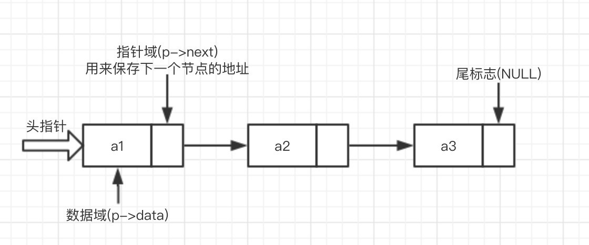
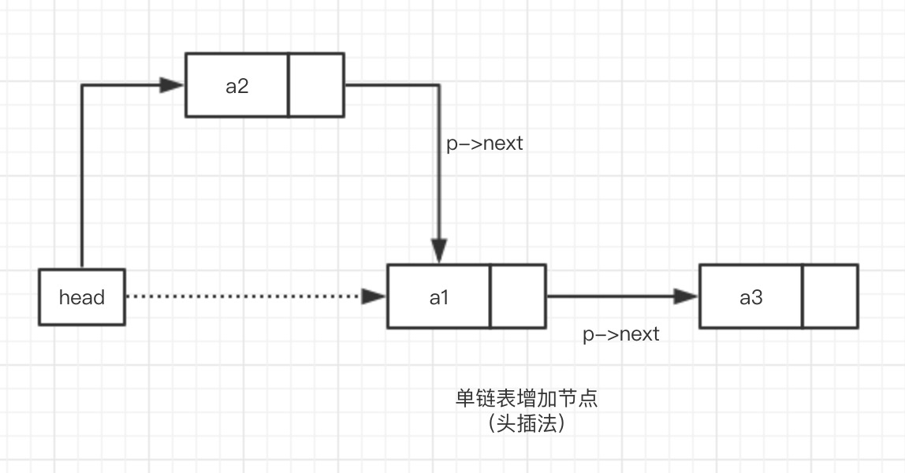
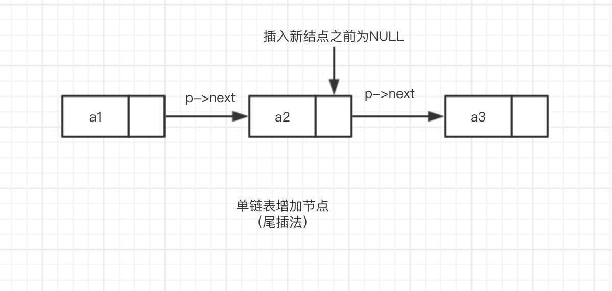
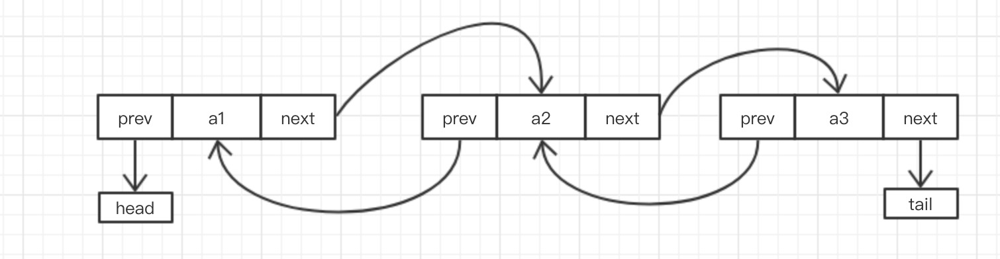
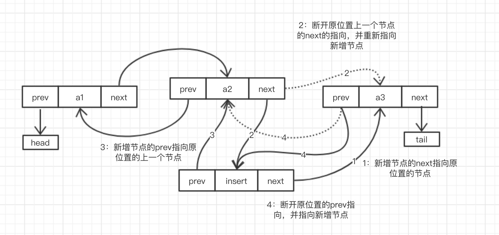
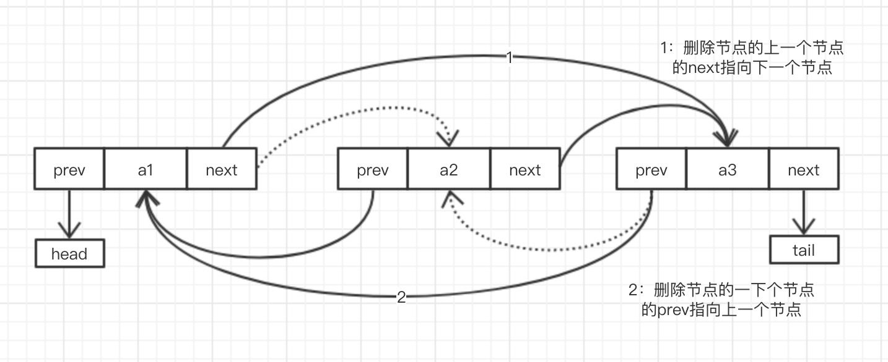
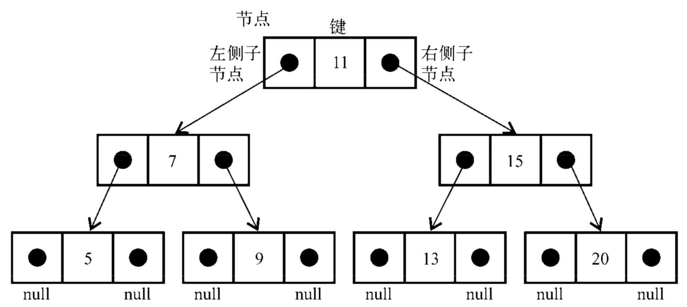

## 目录
* [栈](#栈)
* [队列](#队列)
* [链表](#链表)
* [树](#树)
### 栈
---
<p style="text-indent: 2em">栈是一种遵从后进先出(LIFO)原则的有序集合。新添加的或待删除的元素都保存在栈的同一端，称作栈顶，另一端就叫栈底。在栈里，新元素都靠近栈顶，旧元素都接近栈底。</p>

```javascript
class Stack {
  constructor() {
    this.list = []
    this.length = 0
  }

  push(value) {
    this.length++
    this.list.push(value)
  }

  pop() {
    if (this.length === 0) return

    this.length--
    return this.list.pop()
  }
  // 查看栈顶元素
  peek() {
    return this.list[this.length - 1]
  }
}
```
### 队列
---
<p style="text-indent: 2em">队列是遵循FIFO(First In First Out，先进先出，也称为先来先服务)原则的一组有序的项。队列在尾部添加新元素，并从顶部移除元素。最新添加的元素必须排在队列的末尾。</p>

```javascript
class Queue {
  constructor() {
    this.list = [];
    this.length = 0;
  }

  enqueue(value) {
    this.length++;
    this.list.push(value);
  }

  dequeue() {
    if (this.length === 0) return;

    this.length--;
    return this.list.shift();
  }

  peek() {
    return this.list[0];
  }
}
```
### 链表
---
<p style="text-indent: 2em">链表存储有序的元素集合,但不同于数组，链表中的元素在内存中并不是连续放置的。每个元素由一个存储元素本身的节点和一个指向下一个元素的引用(也称指针或链接)组成。</p>
<p style="text-indent: 2em">相对于传统的数组，链表的一个好处在于，添加或移除元素的时候不需要移动其他元素。然而，链表需要使用指针，因此实现链表时需要额外注意。数组的另一个细节是可以直接访问任何位置的任何元素，而要想访问链表中间的一个元素，需要从起点(表头)开始迭代列表直到找到所需的元素。
</p>

* 单向链表
<p style="text-indent: 2em">由各个内存结构通过一个 next 指针链接在一起组成，每一个内存结构都存在后继内存结构(链尾除外)，内存结构由数据域和 next 指针域组成。</p>

```javascript
class LinkedList {
  constructor() {
    this.head = null // 头节点
    this.length = 0 // 链表长度
  }
}
```

>1. 查找
  ```javascript
  get(position) {
    // 判断position是否越界
    if (position >= this.length || position < 0) {
      throw new Error('Position outside of list range')
    }

    let current = this.head
    // 循环查找节点
    for (let index = 0; index < position; index++) {
      current = current.next
    }

    return current
  }
  ```
>2. 新增
  ```javascript
  // insert node anywhere
  insert(position, element) {
    let node = {
      data: element,
      next: null
    }
    // 头插入
    if (position === 0) {
      node.next = this.head
      this.head = node
    } else {
      // 查找插入位置的上一个节点
      let previous = this.get(position - 1)
      // 将要插入位置的元节点
      let current = previous.next
      // 将当前插入节点与原位置节点连接
      node.next = current
      // 上一个节点与插入节点连接
      previous.next = node
    }

    this.length++
  }

  push(element) {
    this.insert(this.length, element)
  }

  unshift(element) {
    this.insert(0, element)
  }
  ```
  
  
>3. 删除
  ```javascript
  // delete node 
  remove(position) {
    if (!this.head) {
      throw new Error('Removing from an empty list')
    }

    if (position === 0) {
      this.head = this.head.next
    } else {
      let previous = this.get(position - 1)
      // 上一个节点与删除节点的下一个节点连接
      previous.next = previous.next.next
    }

    this.length--
  }
  ```
* 双向链表
<p style="text-indent: 2em">由各个内存结构通过指针 Next 和指针 Prev 链接在一起组成，每一个内存结构都存在前驱内存结构和后继内存结构【链头没有前驱，链尾没有后继】，内存结构由数据域、Prev 指针域和 Next 指针域组成。</p>

```javascript
class DoubleLinkedList {
  constructor() {
    this.head = null
    this.tail = null
    this.length = 0
  }
}
```

>1. 查找
  ```javascript
  // 负数代表从后往前查找
  get(position) {
    const positionABS = position < 0 ? Math.abs(position) - 1 : Math.abs(position)
    if (positionABS >= this.length) {
      throw new Error('Position outside of list range')
    }
    let current = position < 0 ? this.tail : this.head
    // 循环查找节点
    for (let index = 0; index < positionABS; index++) {
      current = position < 0 ? current.prev : current.next
    }

    return current
  }
  ```
>2. 新增
  ```javascript
  insert(position, element) {
    let node = {
      data: element,
      prev: null,
      next: null
    }

    if (position === 0) {
      if (!this.head) {
        this.head = node
        this.tail = node
      } else {
        node.next = this.head
        this.head.prev = node
        this.head = node
      }
    } else if (position === this.length) {
      this.tail.next = node
      node.prev = this.tail
      this.tail = node
    } else {
      let current = this.get(position)
      node.next = current // 新增节点next指向插入位置原节点
      current.prev.next = node // 插入位置上一个节点next指向新增节点

      node.prev = current.prev // 新增节点prev指向插入位置上一个节点
      current.prev = node // 插入位置原节点prev指向新增节点
    }

    this.length++
  }

  push(element) {
    this.insert(this.length, element)
  }

  unshift(element) {
    this.insert(0, element)
  }
```

>3. 删除
  ```javascript
  remove(position) {
    if (!this.head) {
      throw new Error('Removing from an empty list')
    }
    // 移除第一项
    if (position === 0) {
      this.head = this.head.next

      if (this.length === 1) {
        this.tail = null
      } else {
        this.head.prev = null
      }
    } else if (position === this.length - 1) {
      // 移除最后一项
      this.tail = this.tail.prev
      this.tail.next = null
    } else {
      let current = this.get(position)
      current.prev.next = current.next // 将上一节点的next指向下一节点
      current.next.prev = current.prev // 经下一节点的prev指向上一节点
    }

    this.length--
  }
```

### 树
---
<p style="text-indent: 2em">非顺序数据结构——树，它对于存储需要快速查找的数据非常有用。一个树结构包含一系列存在父子关系的节点。每个节点都有一个父节点(除了顶部的第一个节点)以及零个或多个子节点。</p>
<p style="text-indent: 2em">节点：位于树顶部的节点叫作根节点，它没有父节点。树中的每个元素都叫作节点，节点分为内部节点和外部节点。至少有一个子节点的节点称为内部节点。没有子元素的节点称为外部节点或叶节点。</p>
<p style="text-indent: 2em">节点深度：节点的深度取决于它的祖先节点的数量。</p>
<p style="text-indent: 2em">子树：子树由节点和它的后代构成。</p>
<p style="text-indent: 2em">高度：树的高度取决于所有节点深度的最大值。</p>

```javascript
class BinarySearchTree {
  constructor () {
    this.root = null
  } 
}
```


---
#### 二叉搜索树
<p style="text-indent: 2em">二叉树中的节点最多只能有两个子节点:一个是左侧子节点，另一个是右侧子节点。二叉搜索树(BST)是二叉树的一种，但是它只允许你在左侧节点存储(比父节点)小的值，在右侧节点存储(比父节点)大(或者等于)的值。</p>

>1. 插入节点
  ```javascript
  insert (key) {
    let node = {
      key,
      left: null,
      right: null
    }
    if (this.root === null) {
      this.root = node
    } else {
      this.insertNode(this.root, node)
    }
  }

  insertNode (node, newNode) {
    if (!node) return
    // 左子树
    if (newNode.key < node.key) {
      if (node.left === null) {
        node.left = newNode
      } else {
        // 左子树递归插入
        this.insertNode(node.left, newNode)
      }
    } else {
      // 右子树
      if (node.right === null) {
        node.right = newNode
      } else {
        // 右子树递归插入
        this.insertNode(node.right, newNode)
      }
    }
  }
```
>2. 删除节点
  ```javascript
  // 删除节点
  remove (key, node = this.root) {
    if (node === null) {
      throw new Error('Removing an empty tree')
    }
    if (key < node.key) {
      // 递归删除左子树
      this.remove(key, node.left)
    } else if (key > node.key) {
      // 递归删除右子树
      this.remove(key, node.right)      
    } else {
      // 1.删除节点为叶节点
      if (this.isLeafNode(node)) {
        node = null
        return node.key
      }
      // 2.删除节点拥有一个子节点
      if (node.left === null) {
        node = node.right
        return node
      } else if (node.right === null) {
        node = node.left
        return node
      }
      // 3.删除节点拥有两个子节点
      // 首先找到该节点右子树中的最小节点
      let minInRight = this.findMinNode(node)
      // 更新删除节点的值为最小节点的值
      node.key = minInRight.key
      // 删除该最小节点
      this.remove(minInRight.key, node.right)
      return node
    }
  }

  findMinNode (node = root) {
    if (node && node.left !== null) {
      this.findMinNode(node.left)
    }

    return node
  }

  isLeafNode (node) {
    return node.left === null && node.right === null
  }
```
>3. 遍历输出
>>* 先序遍历: 以优先于后代节点的顺序访问每个节点的。先序遍历的一种应用是打印一个结构 化的文档。
>>* 中序遍历: 以上行顺序访问BST所有节点的遍历方式，也就是以从最小到最大的顺序访问所有节点。中序遍历的一种应用就是对树进行排序操作。
>>* 后序遍历: 先访问节点的后代节点，再访问节点本身。后序遍历的一种应用是计算一个目录和它的子目录中所有文件所占空间的大小。
```javascript
  // 先序遍历
  preorderTraversal (callback, node = this.root) {
    if (node !== null) {
      callback(node.key)
      this.preorderTraversal(callback, node.left)
      this.preorderTraversal(callback, node.right)
    }
  }
  // 中序遍历
  inorderTraversal (callback, node = this.root) {
    if (node !== null) {
      this.preorderTraversal(callback, node.left)
      callback(node.key)
      this.preorderTraversal(callback, node.right)
    }
  }
  // 后序遍历
  postorderTraversal (callback, node = this.root) {
    if (node !== null) {
      this.preorderTraversal(callback, node.left)
      this.preorderTraversal(callback, node.right)
      callback(node.key)
    }
  }
```